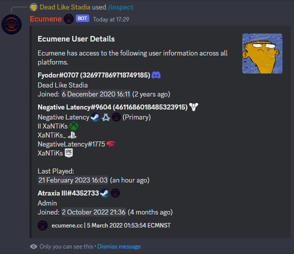

# Ecumene
Advanced interaction between Destiny 2 and Discord. 

## Features
Ecumene allows users to:

 - Manage multiple clans simultaneously within one Discord server via commands.
 - Receive clan invitations directly with one simple command.
 - List users including Bungie and Discord names with activity levels.
 - Manage clan invites and promote, demote or kick users all through Discord.
 - Control permissions by Discord role or even restrict individual access.
 - Audit and monitor robot usage within their server.

## Documentation
 - [Commands](docs/COMMANDS.md)
 - [Frequently Asked Questions](docs/FAQ.md)